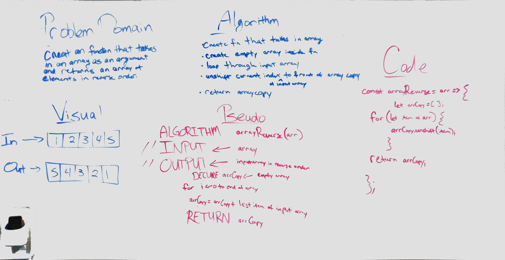

# Data Structures & Algorithms

### Author: James Dunn

### Table of Contents
* [Challenge 01](http://xyz.com)

#### Documentation
* [jsdoc](http://xyz.com) (Server assignments)

#### Running the tests
* `npm test`

****
# Challenge Info
## Code Challenge 01 - Reverse an Array
* The point of this code challenge create a function that sorts an array using vanilla Javascript. The goal is to to complete this challenge using a pure, reusable function.

### Challenge
* Write a function called reverseArray which takes an array as an argument. Without utilizing any of the built-in methods available to your language, return an array with elements in reversed order.

### Approach & Efficiency
* I chose to first create an empty array inside the function. Then, I looped through the input array, starting at the first (or 0th) index and ending at the last index position. For each index, I placed it at the front of the empty array. Finally, I returned the reversed array copy created from this process.

### Solution
