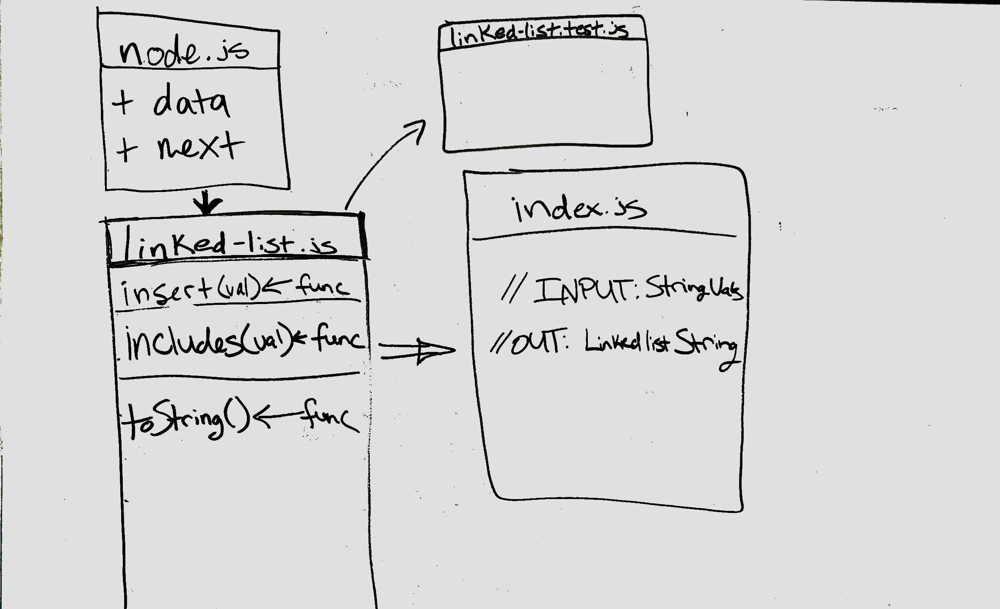

# Challenge Info

## Code Challenge 05 - Linked List

- The point of this code challenge is to create a linked list. The main objective is to get familiar with what a link list is, how it works internally, and how we can move from one item (or node) to the next within this data structure.

### Challenge

- Create a class named Node. This class should contain:
  A variable to hold data (i.e. this.data).
  A variable to hold the next Node object (i.e. this.next).
  Create a class named LinkedList. This class should contain:
  A variable named head which holds the Node object that starts the list.
  A constructor that instantiates head as an empty linked list.
  A function called insert which takes in a value and appends this value to the beginning of the linked list (i.e. it sets a new head).
  A function called includes which takes in a value and returns a boolean if that value exists in the linked list.
  A function called toString whcih takes in no arguments and returns a string representing all the values in the linked list.
  Implement good error checking throughout your code. Create custom errors that describe what went wrong.

### Approach & Efficiency

- For this challenge, I chose first to write comments explaining what the goals were for each function. I wanted to make the code as clean as possible, but still expressive. The logic was fairly straight-forward. As for the verification, I chose to have the functions return values and console.log the functions to verify their efficacy.

## API

- insert(string)

  - This function takes in a value. This function will then create a new Node object, and set the object’s data property equal to the value. The function then appends this new Node object to the beginning of the linked list (i.e. it sets a new head).

- includes(string)

  - This function takes in a value and returns a boolean if that value exists in the linked list.

- toString()
  - This function takes in no arguments and returns a string representing all the values in the linked list.

## Solution

