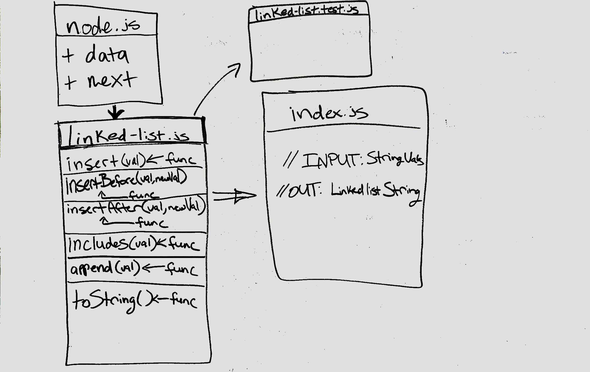

# Challenge Info

## Code Challenge 06 - Linked List Insertion

- The point of this code challenge will be to add alternative insertion operations to a linked list.

### Challenge

- Write the following methods for the Linked List class:

  - .append(value) which adds a new node with the given value to the end of the list

  - .insertBefore(value, newVal) which add a new node with the given newValue immediately before the first value node
  - .insertAfter(value, newVal) which add a new node with the given newValue immediately after the first value node

### Approach & Efficiency

- For this challenge, I chose first to write comments explaining what the goals were for each function. I wanted to make the code as clean as possible, but still expressive. The logic was fairly straight-forward. As for the verification, I chose to run the toString() function, which outputs the entire Linked List, in order to get confirmation that the functions are working properly.

## API

- insert(string)

  - This function takes in a value. This function will then create a new Node object, and set the object’s data property equal to the value. The function then appends this new Node object to the beginning of the linked list (i.e. it sets a new head).

- insertBefore(string)

  - This function adds a Node before a specified Node in the list.

- insertAfter(string)

  - This function adds a Node after a specified Node in the list.

- append(string)

  - This functions adds a Node to the end of the list.

- includes(string)

  - This function takes in a value and returns a boolean if that value exists in the linked list.

- toString()
  - This function takes in no arguments and returns a string representing all the values in the linked list.

## Solution

