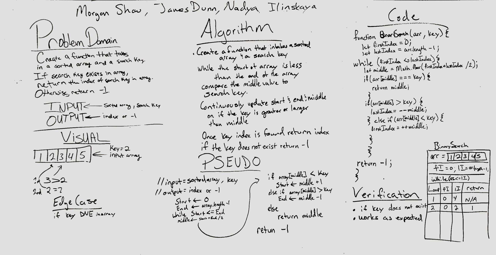

# Challenge Info

## Authors: James Dunn, Morgan, Shaw, Nadya Ilinskaya
****
## Code Challenge 03 - Array Binary Search
* The point of this code challenge create a function that accepts an array and a search key. The goal is to use Binary Search to find the index of the array value that matches the search key if it exists in the array. If the search key is not present in the array, the function should return -1.

### Challenge
* Write a function called binarySearch which takes in 2 parameters: a sorted array and the search key. Without utilizing any of the built-in methods available in JavaScript, return the index of the array element that is equal to the search key, or -1 if the element does not exist.

### Approach & Efficiency
* First, we created variables to hold the current value for the first and last index. Then we performed a while loop, which would would run until first index was not less than or equal to last index. During each iteration, the middle index is decided by adding first and last index together, dividing the sum by two, and math.flooring the result. If middle index is equal to search key, return that and terminate loop. If search is less than middle index value, then firstIndex stays same and lastIndex changes to middle minus 1. If search is greater than middle index value, then lastIndex stays same and firstIndex changes to middle plus 1.

### Solution
