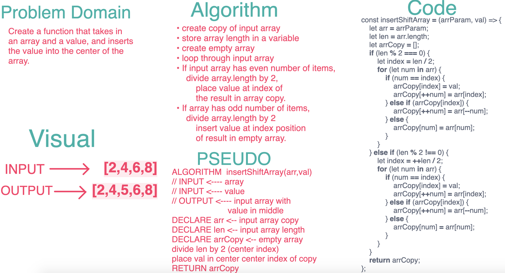

# Challenge Info
## Code Challenge 02 - Shift an Array
* The point of this code challenge create a function that accepts an array and a value, and inserts the value into the middle of the array using vanilla Javascript. The goal is to to complete this challenge using a pure, reusable function.

### Challenge
* Write a function called insertShiftArray which takes in an array and the value to be added. Without utilizing any of the built-in JS methods, return an array with the new value added at the middle index.

### Approach & Efficiency
* I chose to first create a copy of the input array and store the array length in a variable since that will be used throughout the function. Then I created an empty array inside the function. Then, I looped through the input array, starting at the first (or 0th) index and ending at the last index position. 

* If the input array has an even number of items, divide array.length by 2, and place the value at index of the result in the array copy.

 * If the array has an odd number of items, add 1 to array.length then divide the sum by 2 and insert the value at the index position of result in the empty array.

### Solution
