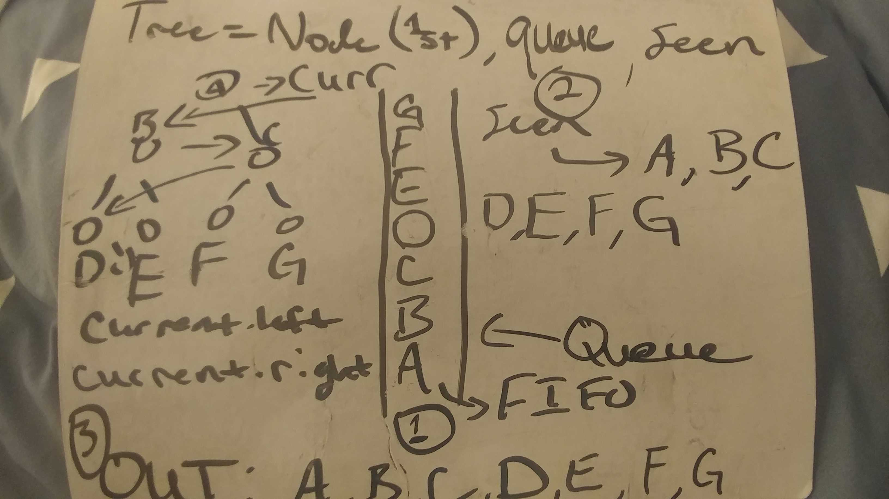

# Code Challenge 17 - Breadth-First Traversal

## Links

- [challenge 16](https://github.com/james-401-advanced-javascript/data-structures-and-algorithms/pull/15)
- [travis](https://www.travis-ci.com/james-401-advanced-javascript/data-structures-and-algorithms)

- The point of this challenge implement breadth-first traversal into my previous BinaryTree class.

## Whiteboard

## Challenge

- Write a breadth first traversal method which takes a Binary Tree as its unique input. Without utilizing any of the built-in methods available to your language, traverse the input tree using a breadth-first approach; print every visited node’s value.

## Approach & Efficiency

- My approach for this challenge was to first draw a diagram of what I was trying to accomplish. Then I wrote comments explaining what each step should be within the function. As for testing, I checked the return values to make sure they were correct in jest. I believe the Big O of time is O(n + l) where n is the number of nodes in the tree and l is the number levels to be traversed. I believe the Big O of space is O(1) since no new data structures are being created outside of the tree itself.

## API

- Queue.enqueue(value)

  - This method takes in a value and add it to the queue. If there is no front, it's assumed the queue is empty, and this the first value is added as both the front and the rear. If there is a front, this becomes the rear/next value of the previous rear.

- Queue.dequeue()

  - This method removes the first node from the queue and returns its value property

- Queue.peek()

  - If there is a "front" property on the queue, meaning it contains at least one Node, this method simply returns the value of that node. If the queue is empty, the method returns -1.

- BinaryTree.breadthFirst()

  - This method traverses through the tree utilizing layer by layer, starting at the root node. It subsequently console.logs the node value at each layer, in the order: current --> current.left --> current.right.

- BinaryTree.preOrder()

  - This method traverses the tree using the pattern root >> left >> right and returns an array of the traversed values.

- BinaryTree.inOrder()

  - This method traverses the tree using the pattern left >> root >> right and returns an array of the traversed values.

- BinaryTree.postOrder()

  - This method traverses the tree using the pattern left >> right >> root and returns an array of the traversed values.
