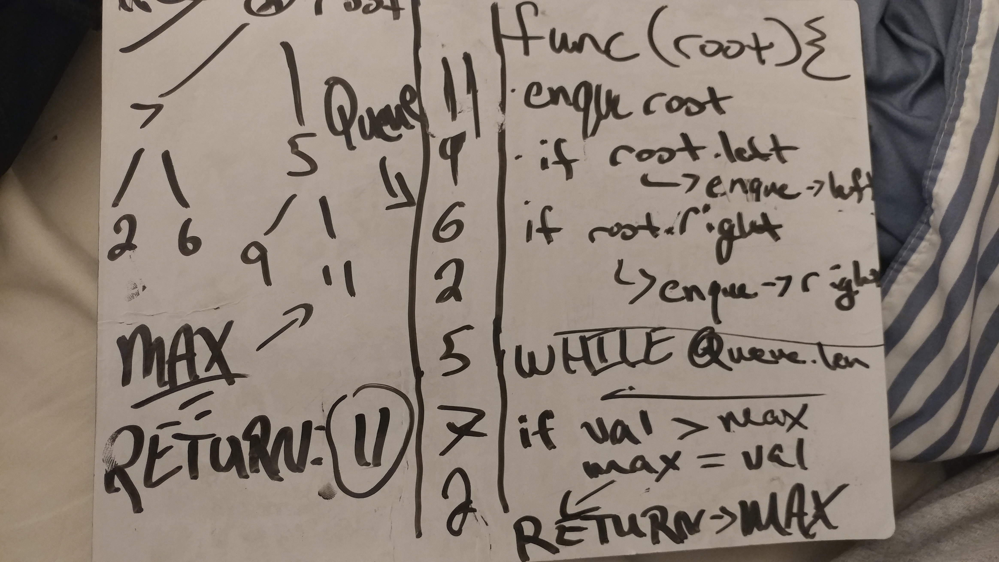

# Code Challenge 18 - Find Maximum Binary Tree

## Links

- [challenge 18](https://github.com/james-401-advanced-javascript/data-structures-and-algorithms/pull/16)
- [travis](https://www.travis-ci.com/james-401-advanced-javascript/data-structures-and-algorithms)

- The point of this challenge is to search a Binary Tree, find the node with the largest numerical value, and return it.

## Whiteboard

## Challenge

- Write a class function called find-maximum-value. Without utilizing any of the built-in methods available to your language, return the maximum value stored in the tree. You can assume that all the values stored in the Binary Tree will be numeric.

## Approach & Efficiency

- For this challenge, I again drew the UML diagram of what the code should be doing in order to accomplish the task of searching for the highest number. I created a variable called "max" and set it to 0. Then I enqueued each node within the tree, and checked each item in the queue to see if it's value was higher than the max variable. If it is, set it as the new max value. After comparing final item in queue, return max variable.

## API

-- Queue.enqueue(value)

- This method takes in a value and add it to the queue. If there is no front, it's assumed the queue is empty, and this the first value is added as both the front and the rear. If there is a front, this becomes the rear/next value of the previous rear.

- Queue.dequeue()

  - This method removes the first node from the queue and returns its value property

- Queue.peek()

  - If there is a "front" property on the queue, meaning it contains at least one Node, this method simply returns the value of that node. If the queue is empty, the method returns -1.

- BinaryTree.findMaximumBinaryTree()

  - This method takes in the node of a numeric Binary Tree, and returns the value of the node with the greatest numerical value
