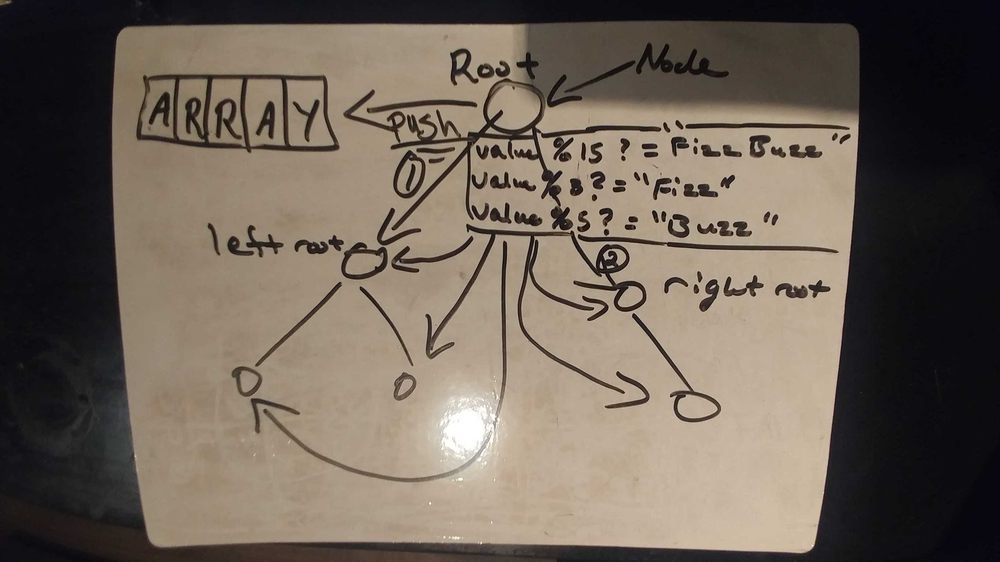

# Code Challenge 16 - Fizz Buzz Tree

## Links

- [challenge 16](https://github.com/james-401-advanced-javascript/data-structures-and-algorithms/pull/14)
- [travis](https://www.travis-ci.com/james-401-advanced-javascript/data-structures-and-algorithms)

- The point of this challenge is to conduct “FizzBuzz” on a tree while traversing through it. Change the values of each of the nodes dependent on the current node’s value.

## Whiteboard

## Challenge

- Write a function called FizzBuzzTree which takes a tree’s root Node as an argument.
- If the value is divisible by 3, replace the value with “Fizz”
- If the value is divisible by 5, replace the value with “Buzz”
- If the value is divisible by 3 and 5, replace the value with “FizzBuzz”
- Return the tree with its new values.

## Approach & Efficiency

- For this challenge, I chose to first draw a diagram of what I was trying to accomplish. Then I wrote comments explaining what the goals were for each function. I made sure to write code to account for any potential errors and edge cases including receiving correct values. As for testing, I checked the return values to make sure they were correct in jest. I believe the Big O for both time and space are O(n) since in a worst case scenario, this method will have to check each node in the tree and creates a new array.

## API

- FizzBuzzTree()

  - This method traverses the tree using to determine whether or not the value of each Node is divisible by 3 and/or 5 and change the value of each of the nodes:
    - If the value is divisible by 3, replace the value with “Fizz”
    - If the value is divisible by 5, replace the value with “Buzz”
    - If the value is divisible by 3 and 5, replace the value with “FizzBuzz”
