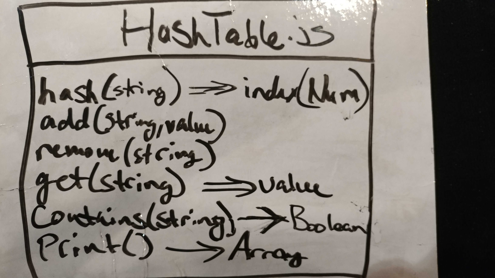

# Code Challenge 26 - Hash Tables

## Links

- [challenge 26](https://github.com/james-401-advanced-javascript/data-structures-and-algorithms/pull/21)
- [travis](https://www.travis-ci.com/james-401-advanced-javascript/data-structures-and-algorithms)

- The point of this challenge is to create a Hash Table with the correct expected functionality.

## Whiteboard

## Challenge

- Implement a Hashtable with the following methods:

  - add: takes in both a key and a value. This function should hash the key, and add the key and value pair to the table, handling collisions as needed.
  - get: takes in the key and returns the value from the table.
  - contains: takes in the key and returns a boolean, indicating if the key exists in the table already.
  - hash: takes in an arbitrary key and returns an index in the collection.

## Approach & Efficiency

- My approach for this challenge was to first draw a diagram of what I was trying to accomplish. Then I wrote comments explaining what each step should be for each method within the class. The number of buckets within the hash table (hashtable length) is determined when the HashTable is instantiated by the number passed in to the class instance upon declaration. As for testing, I checked the return values to make sure they were correct in jest. The Big O of space is O(n) since a new array of key/value pairs is created for each table entry. The Big O of time depends on the method. Big O of:

  - hash is O(n)
  - add is O(n) (for update portion) and O(1) (for add portion)
  - remove is O(n)
  - get is O(n)
  - contains is O(n)
  - print is O(1)

## API

- HashTable.hash(string)

  - This function takes in a string, and determines its index number within the table by adding up the character code for each character within the string, dividing the sum by the amount of buckets in the hash table, and returning the remainder

- HashTable.add(string, value)

  - This function takes in a string and a value. The index of the pair is determined by hashing the string. Then a search for the index number with that string/key name is performed. If the key is found within that index number, its value is updated. If it's not found, it's pushed to that index within the storage array on the instance

- HashTable.remove(string)

  - This function takes in a string. The index of the string is determined by hashing the string. Then a search for the index number with that string/key name is performed. If the key is found within that index number, the key is removed. If it's not found, a false boolean value is returned

- HashTable.get(string)

  - This function takes in a string. The index of the string is determined by hashing the string. Then a search for the index number with that string/key name is performed. If the key is found within that index number, its value is returned. If it's not found, a false boolean is returned

- HashTable.contains(string)

  - This function takes in a string. The index of the string is determined by hashing the string. Then a search for the index number with that string/key name is performed. If the key is found within that index number, a true boolean value is returned. If it's not found, a false boolean is returned

- HashTable.print()

  - This function prints the entire contents of the hashtable