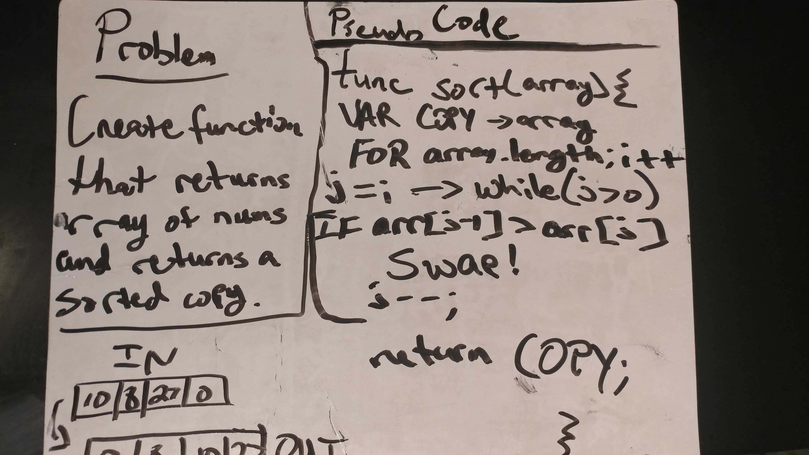

# Challenge 19: Insertion Sort

## Links

- [Challenge 19](https://github.com/james-401-advanced-javascript/data-structures-and-algorithms/pull/17)
- [travis](https://www.travis-ci.com/james-401-advanced-javascript/data-structures-and-algorithms)

### In this challenge, the task is to write an insertion-sort algorithm

## Whiteboard / Drawing

## Challenge

### The point of this challenge is to write a function called insertionSort, which takes an array of numbers and returns a sorted array after using the Insertion Sort algorithm. Do not mutate (change) the array given to you as a parameter

## Approach & Efficiency

I had a pretty good idea of how to approach/solve this problem right away. First, I declared a variable that would specifically house a copy of the input array, since arrays are passed by reference. Then the logic was fairly straightforward from that point. The only other item created was a temp variable to store the value needing to be swapped. This algorithm has a Big O space of O(1) because the only data structure being created is an array copy. It has a big O time of O(n^2) since in a worst case scenario, there will be one full iteration through the array for each item in the array.
