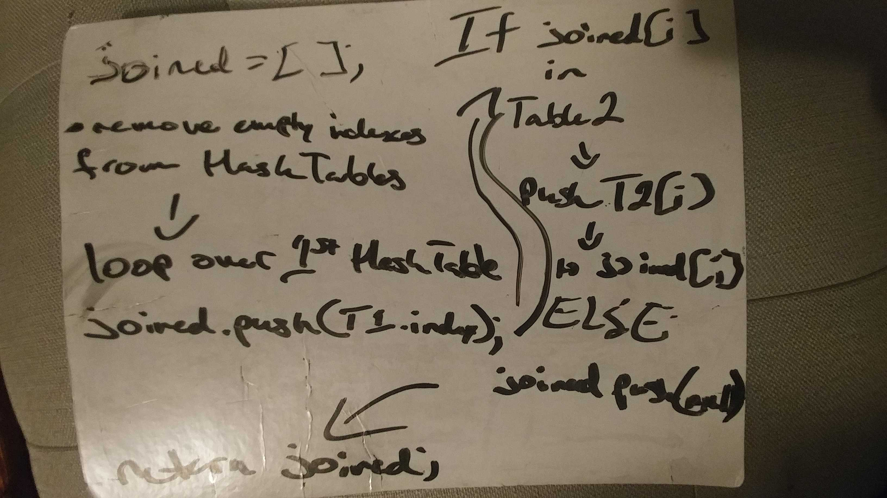

# Code Challenge 28 - Left Join

## Links

- [challenge 28](https://github.com/james-401-advanced-javascript/data-structures-and-algorithms/pull/23)
- [travis](https://www.travis-ci.com/james-401-advanced-javascript/data-structures-and-algorithms)

- The point of this challenge is to write a function that combines two hash tables using the left join process.

## Whiteboard

## Challenge

- Write a function that LEFT JOINs two hash tables into a single data structure
- Assume you know the hash function (use an existing one you’ve developed before)
- The first parameter is a hash table that stores an object containing the original key (a word) and the key’s value (a word that is a synonym)
- The second parameter is a hash table that stores an object containing the original key (a word), and a key’s value (a word that is an antonym)
- Combine the key and corresponding values (if they exist) into a new data structure according to LEFT JOIN logic.
- LEFT JOIN means all the values in the first “left” hash table are returned, and if values exist in the “right” hash table, they are appended to the result row. If no values exist in the “right” hashmap, then some flavor of NULL should be appended to the result row.
- The returned data structure that holds the results is up to you. It doesn’t need to exactly match the output below, so long as it achieves the LEFT JOIN logic
- Avoid utilizing any of the library methods available to your language

## Approach & Efficiency

- My approach for this challenge was to first draw a diagram of what I was trying to accomplish. Then I wrote comments explaining what each step should be for each method within the class. The number of buckets within the hash table (hashtable length) is determined when the HashTable is instantiated by the number passed in to the class instance upon declaration. As for testing, I checked the return values to make sure they were correct in jest. The Big O of space is O(n) since a new array is created in order to push the joined hash-table into. The Big O of time should be O(n2) since it utilizes a nested loop

## API

- leftJoin(HashTable1, HashTable2)

  - This function takes in two hash tables, and returns a left-joined array composed of the values in the two tables.