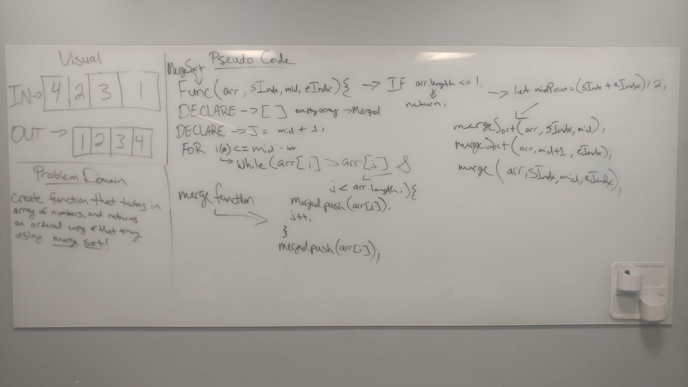

# Challenge 20: Merge Sort

## Links

- [Challenge 19](https://github.com/james-401-advanced-javascript/data-structures-and-algorithms/pull/18)
- [travis](https://www.travis-ci.com/james-401-advanced-javascript/data-structures-and-algorithms)

### In this challenge, the task is to write an merge-sort algorithm

## Whiteboard / Drawing

## Challenge

### The point of this challenge is to write a function called mergeSort, which takes an array of numbers and returns a sorted array after using the Merge Sort algorithm. Do not mutate (change) the array given to you as a parameter

## Approach & Efficiency
