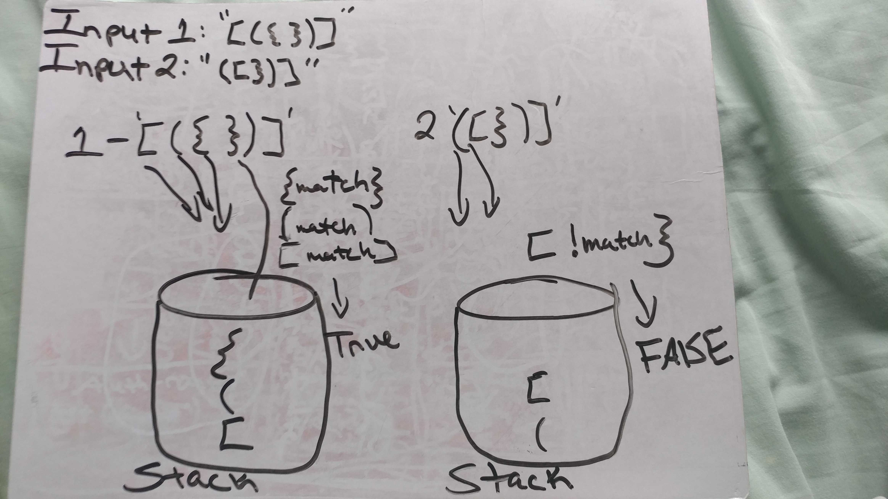

# Code Challenge 14 - Multi-Bracket Validator

## Links

- [challenge 14](https://github.com/james-401-advanced-javascript/data-structures-and-algorithms/pull/13)
- [travis](https://www.travis-ci.com/james-401-advanced-javascript/data-structures-and-algorithms)

* The point of this code challenge is to write a multi-bracket validator.

## Whiteboard

## Challenge

- Create a function called multiBracketValidation(input) that takes in a string as its only argument, and returns a boolean representing whether or not the brackets in the string are balanced.

## Approach & Efficiency

- For this challenge, I chose to first draw a diagram of what I was trying to accomplish. I used a stack within my multiBracketValidation function and pushed all open brackets onto the stack. Then when I encounter a closing bracket, I compare it to the top-most item on the stack to make sure they're a pair, and remove the top from the stack. As for the verification, I just returned true or false and looked for the expected result in my jest tests. I believe the Big O for space and Big0 for time is O(n) because only a single data structure is being created and at most, it will iterate only as many times as there are characters in the string passed in.

## API

- No methods publicly available since this is a function that just takes in a string and returns a boolean. The function does utilize a stack's functionality, including push, pop, and peek. However, I'm not listings those here since those methods are only internally available and, and not publicly accessible.
