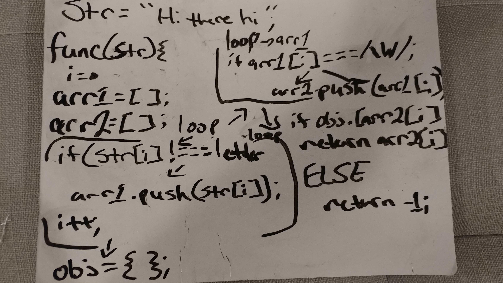

# Code Challenge 25 - Repeated Word

## Links

- [challenge 25](https://github.com/james-401-advanced-javascript/data-structures-and-algorithms/pull/20)
- [travis](https://www.travis-ci.com/james-401-advanced-javascript/data-structures-and-algorithms)

- The point of this challenge is to write a function that finds the first repeated word in a book.

## Whiteboard

## Challenge

- Write a function called repeatedWord, which accepts a lengthy string parameter. Without utilizing any of the built-in library methods available to your language, return the first word to occur more than once in that provided string.

## Approach & Efficiency

- My approach for this challenge was to first draw a diagram of what I was trying to accomplish. Then I wrote comments explaining what each step should be within the function. As for testing, I checked the return values to make sure they were correct in jest. I believe the Big O of time is O(n^2) because the function runs two loops a third loop that is shorter than the previous two. I believe the Big O of space is O(n3) since two arrays, and an object are created inside of the function.

## API

- repeatedWord(string)

  - This function takes in a string of any length. It then puts the words into an array within the function, and discards non-word characters, such as spaces, periods, or commas using regex testing. Each word is added to an object. If that words/key already exists on the object, that word is returned. If there are no matches, the function returns a value of -1.