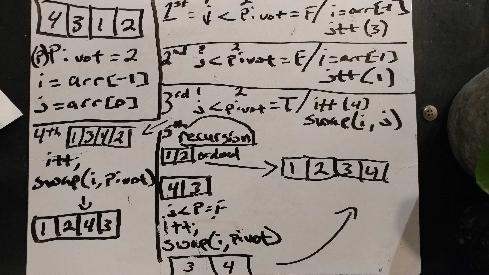

# Code Challenge 25 - Repeated Word

## Links

- [challenge 25](https://github.com/james-401-advanced-javascript/data-structures-and-algorithms/pull/19)
- [travis](https://www.travis-ci.com/james-401-advanced-javascript/data-structures-and-algorithms)

- The point of this challenge is to create a quicksort function.

## Whiteboard

## Challenge

- Write a function called quicksort, which takes an array of numbers and returns a sorted array after using the Quicksort algorithm. Do not mutate (change) the array given to you as a parameter.

## Approach & Efficiency

- My approach for this challenge was to first draw a diagram of what I was trying to accomplish. Then I wrote comments explaining what each step should be within the function. As for testing, I checked the return values to make sure they were correct in jest. I believe the Big O of time O(n2) in worst case scenario and O(n log n) in most cases. I believe the Big O of space is O(2) since a deep copy of the array is created in order to not mutate the input array.

## API

- quicksort(array, sIndx, eIndex)

  - This function utilizes the partition function and the swap function to perform quicksort on an array of numbers. It does not mutate the input array

- partition(array, sIndx, eIndex)

  - This function chooses the pivot, partitions the array based on the pivot, and returns the partitioned array

- swap(array, left, right)

  - This function takes in an array and two items within the array, and then swaps the items within the array. It mutates the input array in accomplishing this.
