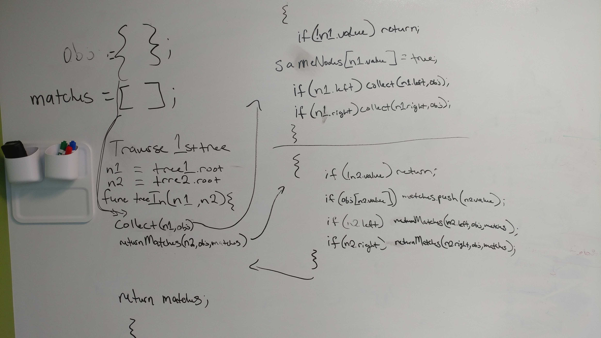

# Code Challenge 25 - Repeated Word

## Links

- [challenge 27](https://github.com/james-401-advanced-javascript/data-structures-and-algorithms/pull/22)
- [travis](https://www.travis-ci.com/james-401-advanced-javascript/data-structures-and-algorithms)

- The point of this challenge is to find the common values in two binary trees.

## Whiteboard

## Challenge

- Write a function called tree_intersection that takes two binary tree root nodes as parameters

- Without utilizing any of the built-in library methods available to your language, return an array of values found in both trees

## Approach & Efficiency

- My approach for this challenge was to first draw a diagram of what I was trying to accomplish. Then I wrote comments explaining what each step should be within the function. As for testing, I checked the return values to make sure they were correct in jest. I believe the Big O of time is O(n) because at most, I would only loop through the trees for as many nodes there are in each tree. I believe the Big O of space is O(2) since an array and an object are created using this algorithm.

## API

- treeIntersection(node1, node2)

  - This function utilizes the collectNodes and returnMatches helper functions to return an array of any node values that are present in both trees passed into this function.

- collectNodes(node, object)

  - This function takes in a node and an object. If the node has no value, we simply return out of the function. If the node has a value, that value is placed on the object as a key with a value of 1. If there are left and right children, the same function is called recursively on them passing in the same object. This function mutates the input object since it's only to be used as a part of this algorithm

- returnMatches(node, object, array)

  - This function takes in a node, an object, and an array. The object has already had items from the first tree added to it, so it should be populated. If the node has no value, the function just returns out. If there is a value, we check the object to see if that object key exists. If it does, node value is pushed to the input array. If there are left and right children, the same function is called recursively on them passing in the same object and array. This function also mutates the input array and object since it's only to be used as a part of this algorithm